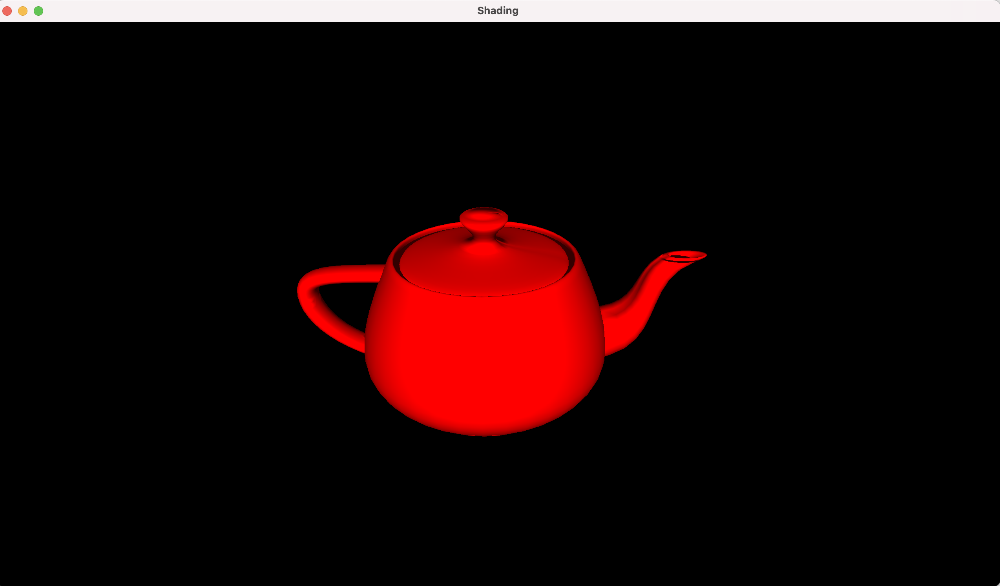
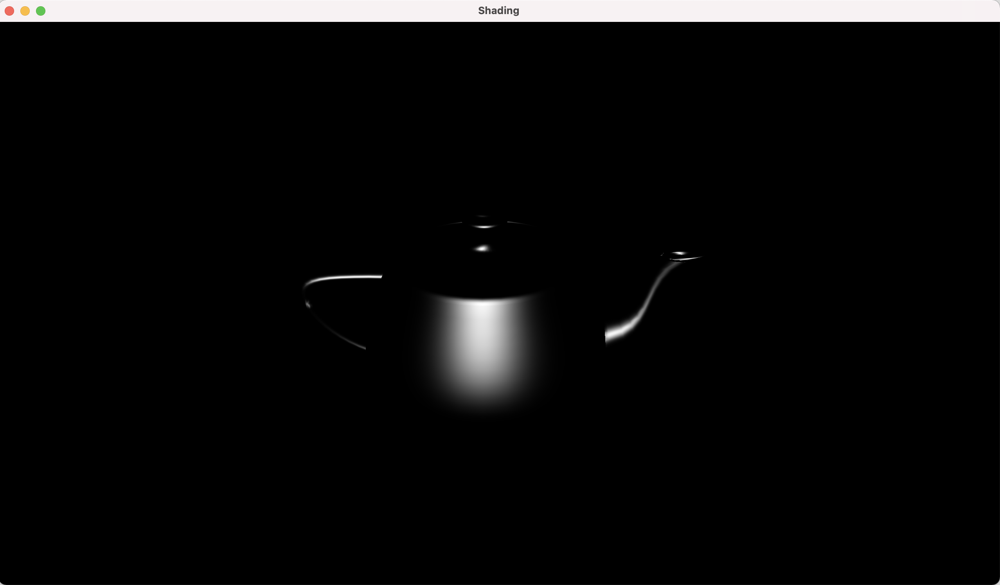
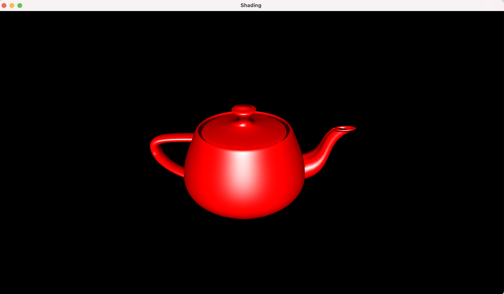
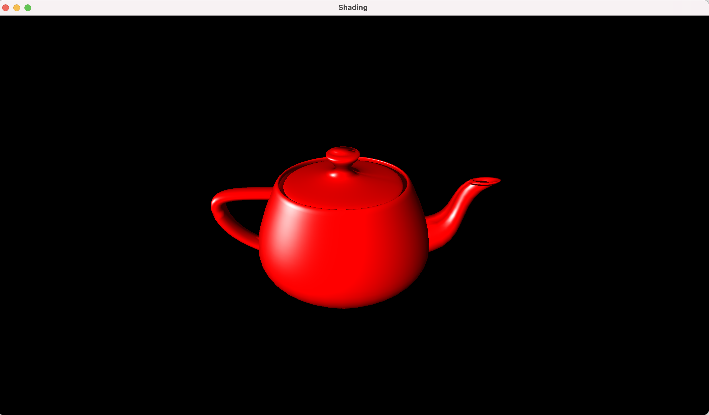
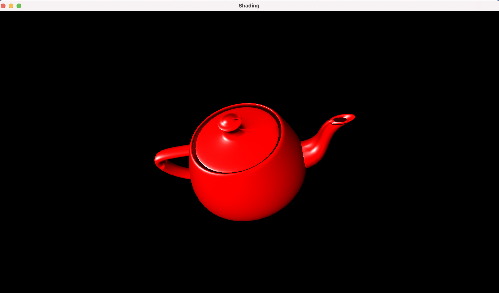

Project 3

Rendering of the teapot with diffuse + ambient shading

Rendering of the specular shading of the teapot

Rendering of the teapot with diffuse, specular and ambient shading

Rotation of the light source using CNTRL + left mouse click

Rotation of the teapot with rotation of the light source

Implementation

1. In addition to the previous project
2. The teapot triangles are formed by processing the faces in the object and storing the vertices in a list.
3. The teapot normals were computed similarly and stored in a VBO as well
4. Calculate the transformation matrix for Model-View and Model-View 3x3 inverse transpose
5. Pass the new uniform and vertex attributes to the vertex and fragment shaders.
6. The vertex shader calculates the vertex and normal positions in the Camera View
7. These vectors are passed to the fragment shader where the diffuse, specular and ambient shading is calculated using the Blinn Material Model.
8. In the main loop
  1. Update the light position in the world space based on the mouse curson callback and Cntrl keypress events.

How to use your implementation

1. Compile the transformations.cpp file, cyCodeBase must be present in the include path

clang++ -std=c++11 -stdlib=libc++ -arch x86\_64 -o shading shading.cpp -lglfw -lglew -framework OpenGL -I/Users/u1316087/Downloads/homebrew/include/ -L/Users/u1316087/Downloads/homebrew/lib/

1. Run the executable

./shading teapot.obj

1. Controls

The mouse left button with CNTRL enables rotating the light source in world space.

What operating system and compiler you used
 Operating System: macOS 11.3 Big Sur

GLFW version: 3.3.6

GLEW version: 2.2.0\_1

Compiler:
 Apple clang version 12.0.5 (clang-1205.0.22.11) Target: x86\_64-apple-darwin20.4.0

External libraries and additional requirements to compile the project.

cyCodeBase, GLFW and GLEW are required
